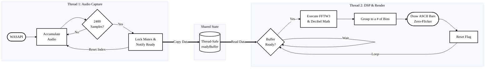

Spectral visualizer written in C++17 using the MinGW compiler (GCC version 15.2.0)

## System Architecture
Terminal Equalizer captures raw system audio directly from the soundcard, processes it through a real-time DSP pipeline, and renders it to the console without screen tearing.



## The DSP Engine
At the core of the visualizer is the **Discrete Fourier Transform (DFT)**, powered by the [FFTW3 C-API](https://www.fftw.org/). <br>
The engine takes a time-domain window of audio samples and transforms it into a number of distinct frequency magnitudes.

$$X_k = \sum_{n=0}^{N-1} x_n e^{-i 2\pi k n / N}$$

 <br>

To make the output visually accurate to human hearing:
1. **Data Scrubbing:** Acts as a firewall against WASAPI driver glitches, dropping `inf`, `NaN`, and integer overflows.
2. **Decibel Conversion:** Raw amplitudes are normalized and converted to a logarithmic $\text{log}_{10}$ scale.
3. **Frequency Binning:** The pitches are averaged down into a number visual UI bins, depending on the terminal size.

## Getting Started
**Prerequisites**
* **MSYS2 / MinGW-w64**
* **CMake**
* **FFTW3** library installed via MSYS2

**Dependencies**
* **FFTW3** (`libfftw3-3.dll`): Included in `thirdparty/lib/`. 
  * *Note: The included DLL is pre-compiled for Windows x64. If you are building on a different architecture, you will need to swap this file with the correct binary from the [FFTW website](https://www.fftw.org/).*

## Running It
```bash
git clone https://github.com/majockbim/terminal-equalizer
cd terminal-equalizer

# Compile the project
cmake -S . -B output -G "MinGW Makefiles"
cmake --build output

# Run!
.\output\terminal-equalizer.exe
```

## References & Libraries

**Documentation & Readings:** <br>
[WASAPI: IAudioEndpointVolume](https://learn.microsoft.com/en-us/windows/win32/api/endpointvolume/nn-endpointvolume-iaudioendpointvolume) <br>
[WASAPI: audioclient.h](https://learn.microsoft.com/en-us/windows/win32/api/audioclient/) <br>
[WASAPI: IAudioClient::Initialize](https://learn.microsoft.com/en-us/windows/win32/api/audioclient/nf-audioclient-iaudioclient-initialize) [4] <br>
[Fast Fourier Transform (Wiki)](https://en.wikipedia.org/wiki/Fast_Fourier_transform) <br>

**Third-Party Libraries**: <br>
[FFTW (org)](https://www.fftw.org/) <br>
[FFTW (GitHub)](https://github.com/FFTW/fftw3)

GNU GENERAL PUBLIC LICENSE v3.0 (GPL-3.0)